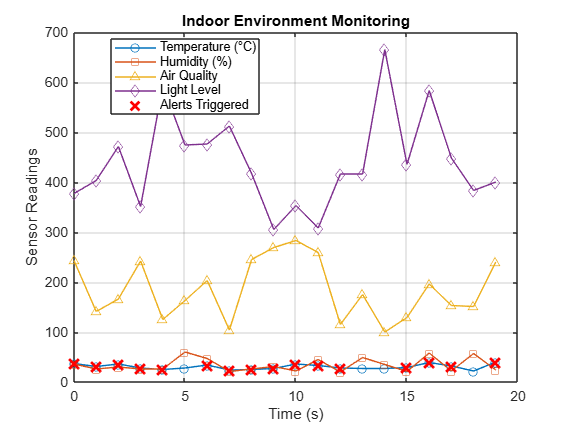

# Indoor Environment Monitoring System (Mbed OS Simulation + MATLAB Analysis)

This project simulates an indoor monitoring system using Mbed OS and visualizes the sensor data using MATLAB.

 OVERVIEW

- Simulated sensors: Temperature, Humidity, Air Quality, Light Level
- Environment alerts triggered for abnormal conditions
- No hardware required — full software simulation
- Output saved in CSV format, analyzed and plotted using MATLAB

---
PROJECT FILES

| File | Description |
| `main.cpp` | Mbed OS C++ code simulating indoor sensors |
| `explanation of main.cpp` | explains about the code and difference between MBed OS and Arduino IDE for self reference |
| `c++ compiler`| used c++ compiler as keil studio cloud does not run code without complete hardware connections|
| `MATLAB code` | MATLAB script to generate plot |
| `screenshot_plot.png` | Sample output plot from MATLAB for visual analysis of sensor data|

---

SAMPLE OUTPUT PLOT

---

TOOLS USED
- [Keil Studio Cloud](https://keil.arm.com/studio) (Mbed OS simulation)
- [MATLAB Online](https://matlab.mathworks.com) (Data plotting)

---

AUTHOR
**Bhavya Merugu.** | ECE Fresher (2025)

